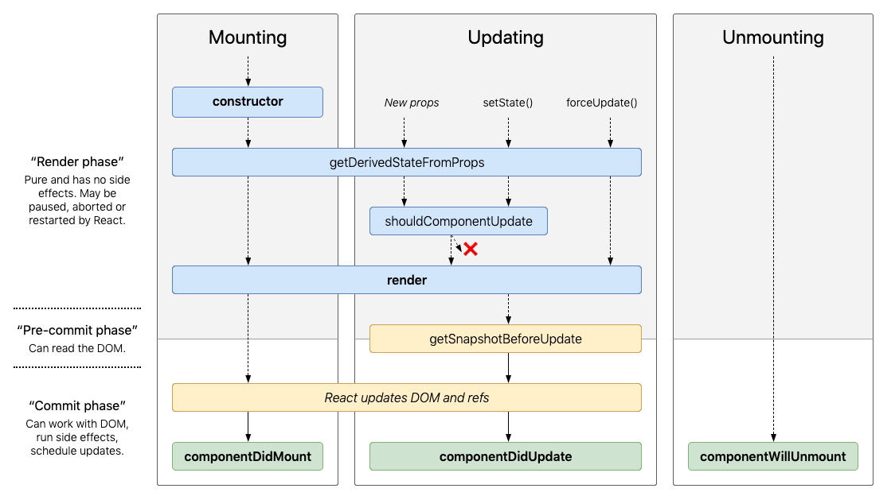

# Component

## Lifecycle



## Commonly Used Lifecycle Methods

### render()

1. return types
   - React elements
   - Array and fragments
   - Portals
   - String and numbers
   - Booleans or null
2. don't modify component state in `render()`
3. will not be invoked if `shouldComponentUpdate()` return false

```js
render();
```

### constructor()

- initialize component state
- bind class methods to instance
- otherwise don't need to implement a constructor
- should not call `setState()`

```js
constructor(props) {
  super(props);
  // Don't call this.setState() here!
  this.state = { counter: 0 };
  this.handleClick = this.handleClick.bind(this);
}
```

### componentDidMount()

- instantiate the network request
- manipulate DOM nodes
- set up subscriptions
- call `setState()` immediately will trigger an extra rendering

```js
componentDidMount();
```

### componentDidUpdate()

- similarly to `compnentDidMount()`
- will not be invoked if `shouldComponentUpdate()` return false

```js
componentDidUpdate(prevProps, prevState, snapshot);
```

### componentWillUnmount()

- clean up
- should not call `setState()`

```js
componentWillUnmount();
```

## rarely Used Lifecycle Methods

### shouldComponentUpdate()

- only use it as **performance optimization**

```js
shouldComponentUpdate(nextProps, nextState);
```

### static getDerivedStateFromProps()

- it's a static method
- it should return an object to update the state, or null to update nothing
- this method exiists for rare use cases where the state depends on changes in props over time

```js
static getDerivedStateFromProps(props, state)
```

### getSnapshotBeforeUpdate()

- it enables your component to capture some information from the DOM (e.g. scroll position) before it is potentially changed
- a snapshot value (or `null`) should be returned
- any value returned by this lifecycle will be passed as a parameter to `componentDidUpdate()`

```js
getSnapshotBeforeUpdate(prevProps, prevState) {
    // Are we adding new items to the list?
    // Capture the scroll position so we can adjust scroll later.
    if (prevProps.list.length < this.props.list.length) {
      const list = this.listRef.current;
      return list.scrollHeight - list.scrollTop;
    }
    return null;
  }
```

## Error Boundaries

**Error boundaries only catch errors in the components below them in the tree. An error boundary can't catch an error within itself**

**Error boundaries catch errors**

- during rendering
- in lifecycle methods
- in constructors

**Error boundaries do not catch errors for**

- event handlers
- asynchronous code
- sever side rendering
- errors thrown in the error boundary itself

### static getDerivedStateFromError()

- it's a static method
- should return a value to update state
- only use it to change UI

```js
// error - the error that was thrown
static getDerivedStateFromError(error) {
  // Update state so the next render will show the fallback UI.
  return { hasError: true };
}
```

### componentDitCatch()

- should be used for things like logging errors

```js
// error - the error that was thrown
// info - an object with a componentStack key containing information about which component threw the error
componentDidCatch(error, info) {
    // Example "componentStack":
    //   in ComponentThatThrows (created by App)
    //   in ErrorBoundary (created by App)
    //   in div (created by App)
    //   in App
    logComponentStackToMyService(info.componentStack);
  }
```

## Other APIs

### setState()

- do not modify state directly
- state updates may be asynchronous
- state updates are merged
- reading `this.state` right after calling `setState()` may fail, use `componentDidUpdate()` or a `setState()` callback
- `setState()` will always lead to a re-render unless `shouldComponentUpdate()` returns `false`
- if the next state depends on the current state, use the updater function form

```js
// updater - a function return a object or a object
// callback - will be executed once setState() is completed and the component is re-rendered
// Generally we recommend using componentDidUpdate() for such logic instead
setState(updater[, callback])

this.setState((state) => {
  return {quantity: state.quantity + 1};
});
```

### forceUpdate()

Calling `forceUpdate` will cause `render()` to be called on the component, skipping `shouldComponentUpdate()`. This will trigger the normal lifeCycle methods for child components, including ths `shouldComponentUpdat()` method of each child.

Normally you should try to avoid all uses of `forceUpdate()` and only read from `this.props` and `this.state` in `render()`

## Class Properties

### defaultProps

- used for undefined props, but not for null props

```js
class CustomButton extends React.Component {
  // ...
}

CustomButton.defaultProps = {
  color: 'blue'
};
```
