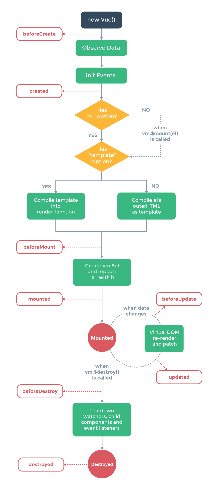

# vue框架

## vue实例

### 创建

使用vue构造函数

````js
const vm = new Vue({
    //options
});
````
### 扩展vue构造函数
````js
const myComponent = Vue.extent({
    //extension options
});
const myComponentInstance = new myComponent();
````

不推荐使用扩展的方式，推荐使用声明式的组合自定义元素的方式。每个vue组件本质上都是扩展的vue实例。

### 属性和方法

* vue会代理data对象中的所有属性，使他们成为响应式的。但在vue实例创建之后附加的属性不会被代理
* vue提供了一些实例属性和实例方法，它们都以“$”为前缀。
* 不要在vue实例属性或者回调函数上使用箭头方法，会有this绑定问题

### vue实例生命周期


## 模板语法

### 插值

* 只能用于文本
* 使用Mustache语法
* 会对html标签进行转义
* 对应于data中的属性，会响应属性的更改

````html
<span>{{msg}}</span>
````
可以使用v-once指定使插值不改变，但也会影响节点上绑定的属性
````html
<span v-once>{{msg}}</span>
````

### 原始html

使用v-html指定来输出未经转义的html标签

````html
<div v-html="rawHtml"></div>
````

### 标签属性
